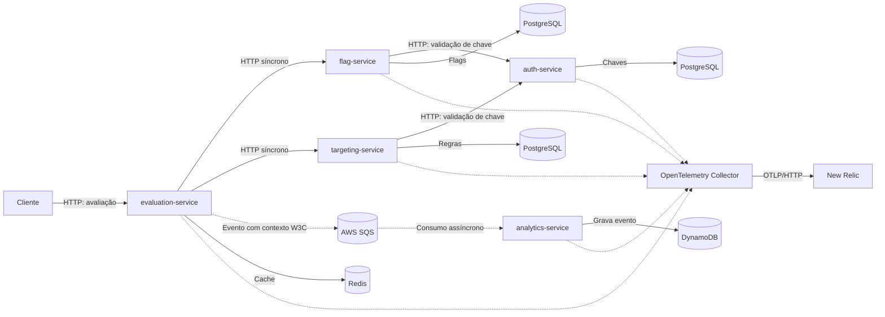

# Observabilidade e rastreamento distribuído

Este documento descreve a instrumentação OpenTelemetry dos cinco
microsserviços, a exportação da telemetria para New Relic e como validar traces
distribuídos e o mapa de dependências.

## Visão geral

A solução usa **OpenTelemetry** para instrumentar aplicações e um
**OpenTelemetry Collector** para receber e encaminhar telemetria ao New Relic.
Não é usado o agente nativo de instrumentação da New Relic.

Os três pilares são:

- **Traces:** spans representam requisições HTTP, chamadas entre serviços e
  processamento assíncrono de mensagens. O contexto W3C (`traceparent` e,
  quando presente, `tracestate`) correlaciona os spans.
- **Métricas:** os SDKs e instrumentors habilitados exportam métricas OTLP. A
  disponibilidade de uma métrica específica depende das operações e
  instrumentors ativos.
- **Logs:** logs Go continuam disponíveis em `stderr` e também são enviados
  pelo SDK de logging OpenTelemetry. Nos serviços Python, o instrumentor de
  logging está habilitado para exportação pelo Collector.

Todos os serviços usam seu próprio `service.name` e o atributo
`deployment.environment`. Assim, New Relic pode distinguir os serviços e o
ambiente de execução.

## Arquitetura e comunicação

O `evaluation-service` faz chamadas HTTP síncronas para `flag-service` e
`targeting-service`. Esses serviços validam a chave de serviço junto ao
`auth-service`. Depois da avaliação, `evaluation-service` publica um evento
assíncrono no SQS; `analytics-service` consome a mensagem e persiste o evento.



As linhas contínuas representam chamadas/uso de dependências da aplicação; as
linhas pontilhadas do Collector representam exportação de telemetria, não
chamadas de negócio. `analytics-service` não é uma chamada HTTP síncrona direta
do endpoint de avaliação: a ligação é feita por mensagem SQS.

### Instrumentação por linguagem

| Serviço | Linguagem | Instrumentação relevante |
| --- | --- | --- |
| `evaluation-service` | Go | OpenTelemetry SDK, `otelhttp` no servidor e no cliente HTTP, hook OpenTelemetry do go-redis e span produtor SQS |
| `auth-service` | Go | OpenTelemetry SDK, `otelhttp` no servidor e instrumentação `database/sql` |
| `flag-service` | Python | `opentelemetry-instrument`, Flask, `requests` e psycopg2 |
| `targeting-service` | Python | `opentelemetry-instrument`, Flask, `requests` e psycopg2 |
| `analytics-service` | Python | `opentelemetry-instrument`, Flask, logging e Botocore; extração explícita de contexto na mensagem SQS |

Os serviços enviam OTLP/HTTP protobuf para `otel-collector:4318`. O Collector
encaminha traces, métricas e logs ao endpoint OTLP do New Relic. A chave de
ingestão fica no ambiente do Collector; não deve ser gravada no repositório ou
incluída nas imagens.

## Propagação de contexto

Nas chamadas HTTP, o transporte instrumentado propaga o contexto W3C entre
cliente e servidor. Com isso, os spans de `flag-service` e `targeting-service`
podem ser correlacionados ao trace que começou no `evaluation-service`; as
chamadas de validação podem, por sua vez, incluir `auth-service`.

O caminho assíncrono usa propagação explícita:

1. `evaluation-service` inicia um span produtor para o envio da mensagem SQS.
2. O produtor injeta `traceparent` e `tracestate` nos atributos da mensagem.
3. `analytics-service` solicita esses atributos ao receber mensagens e extrai o
   contexto W3C.
4. O consumidor inicia um span para processar a mensagem e gravar o evento.

Como o processamento via fila é assíncrono, o span consumidor pode ocorrer
depois da resposta HTTP da avaliação. A correlação pelo mesmo contexto permite
encontrar ambos no trace, mas não significa que o cliente HTTP aguardou a
conclusão do processamento analítico.

## Distributed Trace e Service Map

Essas visualizações respondem a perguntas diferentes:

- **Distributed Trace** mostra os spans correlacionados por um `trace.id` de
  uma execução. É a visualização adequada para inspecionar a sequência,
  duração e resultado das operações e confirmar quais serviços participaram
  daquele trace.
- **Service Map** agrega relações observadas entre serviços no intervalo e no
  contexto selecionados pelo New Relic. É uma visão de dependências, não a
  árvore detalhada de spans de uma única requisição. O mapa pode apresentar
  um serviço e seus vizinhos, e a navegação a partir de outro serviço pode
  revelar relações adicionais.

Na captura validada neste projeto, o mapa centrado em `evaluation-service`
mostrou `analytics-service`, `targeting-service` e `flag-service`; ao abrir
`flag-service`, foi possível ver `auth-service`. Isso é compatível com a
topologia do código: `auth-service` é chamado por serviços intermediários, não
diretamente por `evaluation-service`. Não se deve afirmar que o New Relic
sempre limita o mapa a exatamente um nível, nem que uma única captura
necessariamente exibirá todas as relações: o resultado depende da visualização,
do intervalo de tempo e das relações de telemetria observadas.

Para demonstrar o fluxo ponta a ponta, use a visualização do trace com os cinco
serviços. Para demonstrar o mapa, registre as relações que a interface
efetivamente exibir e indique quando elas são observadas em mapas navegados a
partir de serviços diferentes. Não apresente várias capturas como se fossem
um único mapa.

## Validação automatizada

O script
[`scripts/observability/test-distributed-traces.sh`](../scripts/observability/test-distributed-traces.sh)
executa uma avaliação e consulta o NerdGraph do New Relic:

1. Confirma que o endpoint de saúde do `evaluation-service` responde.
2. Gera um `trace_id` e envia uma requisição de avaliação com o cabeçalho W3C
   `traceparent`.
3. Se a avaliação for bem-sucedida, consulta `Span` no New Relic pelo mesmo
   `trace.id`, aguardando a ingestão.
4. Exibe o trace ID e os nomes distintos de serviços encontrados.

Por padrão, o script exige dois serviços (`MIN_SERVICE_COUNT=2`); para esta
validação de cinco serviços, execute-o com `MIN_SERVICE_COUNT=5`. O script
verifica o número mínimo de `service.name` distintos e a presença de
`evaluation-service`. Ele não valida sozinho um conjunto fixo dos outros quatro
nomes nem a topologia exata das relações; confirme esses detalhes no resultado
da consulta e na interface do New Relic.

A execução reportada em **2026-10-09** encontrou
`evaluation-service`, `analytics-service`, `flag-service`, `auth-service` e
`targeting-service` no mesmo trace. Esse resultado comprova aquela execução,
não garante que futuras requisições incluam todos os serviços. Uma resposta em
cache pode evitar chamadas a `flag-service` ou `targeting-service`, e o trecho
analítico depende de envio, entrega e consumo bem-sucedidos no SQS.

O script requer `NEW_RELIC_ACCOUNT_ID` e uma chave New Relic de usuário/consulta
com acesso ao NerdGraph. Essa chave **não** é a licença de ingestão usada pelo
Collector. Execute a validação de cinco serviços assim, substituindo o ID pelo
da sua conta:

```sh
NEW_RELIC_ACCOUNT_ID="SEU_ID_DA_CONTA" \
MIN_SERVICE_COUNT=5 \
scripts/observability/test-distributed-traces.sh
```

Se `NEW_RELIC_USER_API_KEY` não estiver definida, o script solicitará a chave
de consulta sem exibi-la. O passo a passo de configuração local e execução está
no [runbook de observabilidade](./runbooks/observability.md).

## Amostragem, latência e diagnóstico

- **Amostragem:** o código não configura uma política customizada de sampling.
  Não assuma que toda requisição será retida em qualquer ambiente; confirme a
  configuração efetiva dos SDKs/instrumentors e a disponibilidade dos spans no
  New Relic.
- **Latência:** compare a duração dos spans de servidor e cliente para localizar
  em qual chamada o tempo foi gasto. Para o caminho assíncrono, considere o
  tempo de fila e o processamento do consumidor separadamente do tempo de
  resposta HTTP da avaliação.
- **Gargalos:** procure spans lentos ou com erro, compare-os com chamadas
  adjacentes no trace e verifique métricas/logs correlacionados antes de
  atribuir a causa a um serviço ou banco de dados.
- **Dependências:** Redis e PostgreSQL só aparecem como spans/dependências
  quando as operações instrumentadas são executadas e a telemetria
  correspondente chega ao New Relic. A configuração do Collector ou o estado
  saudável dos containers, isoladamente, não prova ingestão.

## Referências de implementação

- Compose e nomes de serviço: [`deploy/local/docker-compose.yml`](../deploy/local/docker-compose.yml)
- Exportação OTLP ao New Relic: [`deploy/observability/otel-collector/config.yaml`](../deploy/observability/otel-collector/config.yaml)
- OpenTelemetry e runbook local: [`docs/runbooks/observability.md`](./runbooks/observability.md)
- Validação automatizada: [`scripts/observability/test-distributed-traces.sh`](../scripts/observability/test-distributed-traces.sh)
